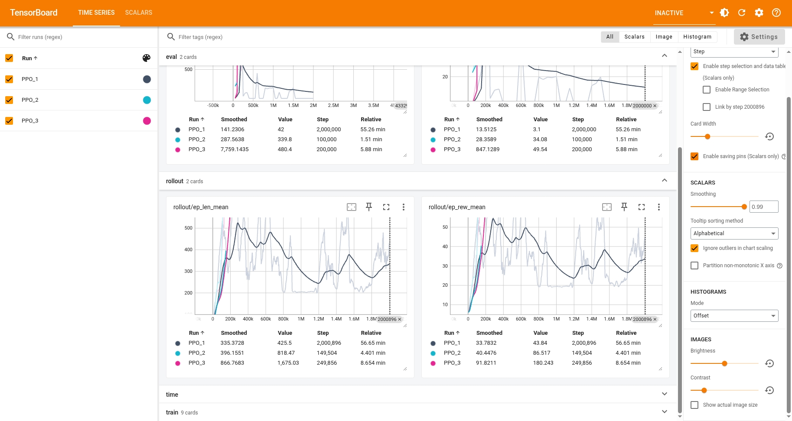

# Flappy Bird RL: High-Performance Reinforcement Learning with Go & Python

[](https://golang.org/)
[](https://www.python.org/)
[](https://github.com/DLR-RM/stable-baselines3)

An advanced Reinforcement Learning project that combines the performance of **Go** for game engine simulation with the flexibility of **Python** and **Stable-Baselines3** for training PPO agents.


*Training progress showing the agent learning to navigate pipes efficiently.*

---

## 🏗️ Architecture

This project utilizes a hybrid architecture to leverage the best of both worlds:

1.  **Game Engine (Go)**: High-speed, deterministic physics and game logic.
2.  **C ABI Bridge**: A thin wrapper that exports Go functions to C-compatible signatures.
3.  **RL Environment (Python)**: A Gymnasium-compatible wrapper that calls the Go backend via `ctypes`.
4.  **Training (Stable-Baselines3)**: State-of-the-art PPO implementation for agent training.

```text
[ Python RL Agent (PPO) ] <--> [ Gymnasium Wrapper ] <--> [ C ABI Bridge (.so) ] <--> [ Go Game Engine ]
```

---

## 🚀 Key Features

- **Hybrid Tech Stack**: Go-powered simulation for maximum performance and Python for rapid RL development.
- **Gymnasium Compatible**: Fully integrated with the standard `gymnasium` interface.
- **Visualization**: Real-time rendering using OpenCV for monitoring AI behavior.
- **Deterministic**: Controlled seeding across both Go and Python environments for reproducible results.

---

## 🛠️ Getting Started

### Prerequisites

- **Go** 1.20+
- **Python** 3.10+
- **Make** (optional, for build automation)

### 1. Build the Go Shared Library

The Go engine must be compiled into a shared library to be accessible by Python.

```bash
go build -buildmode=c-shared -o flappy_rl.so ./cmd/rl_bridge
```

### 2. Setup Python Environment

We recommend using a virtual environment.

```bash
python3 -m venv .venv
source .venv/bin/activate
pip install -r requirements.txt
```

---

## 🎮 Usage

### Training the Agent

Start the training process using PPO. The script will save models to the `models/` directory.

```bash
python train.py
```

### Visualizing the AI

Watch the trained AI play the game in real-time.

```bash
python visualize_model.py
```

### Resuming Training

If you have a saved model and want to continue training:

```bash
python resume-train.py
```

---

## 📊 Training Metrics

The agent is trained to maximize survival time and pipe clearance. Key metrics tracked via TensorBoard include:

- `ep_rew_mean`: Average reward per episode (indicates game skill).
- `ep_len_mean`: Average survival steps (higher is better).
- `explained_variance`: Stability of the value function.

You can monitor training progress using TensorBoard:

```bash
tensorboard --logdir models/logs/
```

---

## 📚 Documentation

For deeper dives into the technical details, check out the following guides:

- [Build Flappy Bird with Go](docs/flappy-bird-go.md)
- [Build Flappy Bird RL Bridge (Go -> C ABI -> Python)](docs/flappy-bird-rl-bridge.md)
- [Gymnasium Introduction](docs/gymnasium-introduction.md)
- [Setup Cloud for Training](docs/setup-cloud-for-train.md)
- [Training Metrics Explanation](docs/training-metrics.md)

---

## 📂 Project Structure

- `cmd/`: Entry points for the Go engine and the RL bridge.
- `internal/`: Core game logic and physics implementation in Go.
- `flappy_env.py`: Python Gymnasium wrapper.
- `train.py` / `test_model.py`: RL training and testing scripts.
- `docs/`: Detailed technical documentation.

---

## 📜 License

This project is licensed under the MIT License - see the LICENSE file for details.
