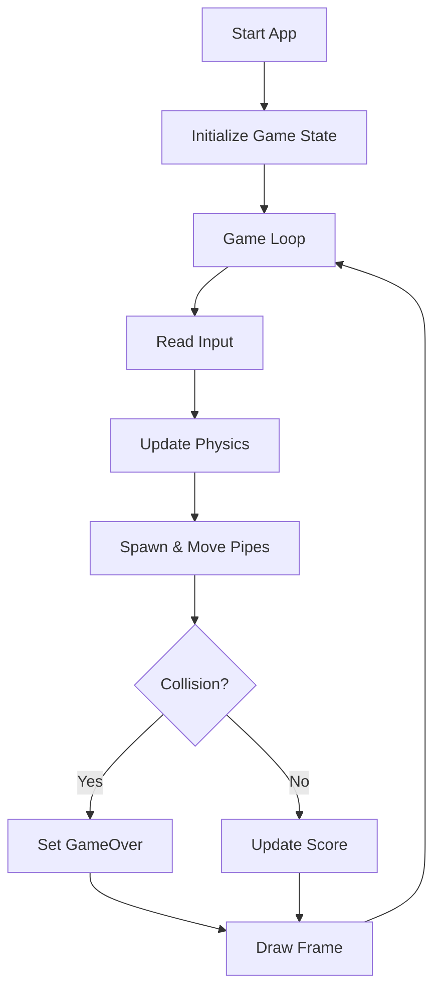
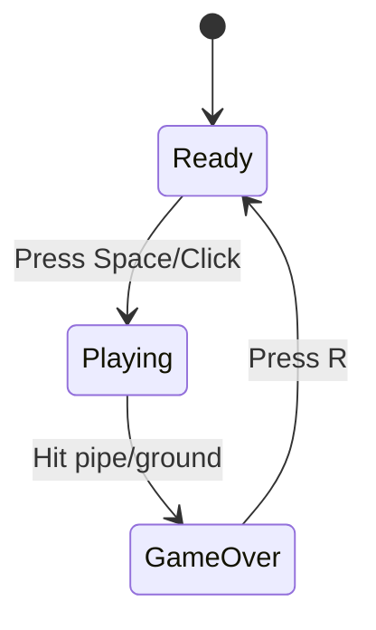

# Build Flappy Bird with Go

This guide explains the core Go knowledge you need and a practical flow to build a Flappy Bird game using Go + Ebiten.

## 1. Prerequisites

- Go installed (recommended: latest stable version)
- Basic terminal usage
- A code editor (VS Code, GoLand, etc.)

Install game library:

```bash
go get github.com/hajimehoshi/ebiten/v2
```

## 2. Go knowledge you need

### Core language concepts

1. **Packages and modules**: keep code organized (`main`, `internal/game`, etc.).
2. **Structs and methods**: model entities like `Bird`, `Pipe`, and `Game`.
3. **Pointers**: update shared game state efficiently.
4. **Slices**: store dynamic pipe lists.
5. **Interfaces**: Ebiten expects `Update`, `Draw`, and `Layout` methods.
6. **Time and randomness**: control spawn timing and procedural pipe gaps.

### Minimal game type example

```go
type Game struct {
    bird   Bird
    pipes  []Pipe
    score  int
    state  GameState
}

func (g *Game) Update() error {
    // input, physics, spawn, collision, score
    return nil
}

func (g *Game) Draw(screen *ebiten.Image) {
    // draw background, pipes, bird, UI
}

func (g *Game) Layout(outsideW, outsideH int) (int, int) {
    return 480, 640
}
```

## 3. Recommended project structure

```text
.
├── cmd/flappy/main.go
├── internal/game/
│   ├── game.go
│   ├── bird.go
│   ├── pipe.go
│   ├── collision.go
│   └── state.go
└── assets/
    ├── bird.png
    ├── pipe.png
    └── bg.png
```

## 4. Build flow (from zero to playable)

1. **Initialize window and loop**
   - Create `Game` struct.
   - Run `ebiten.RunGame(game)`.
2. **Implement bird physics**
   - Gravity each frame.
   - Jump impulse on key press.
3. **Generate and move pipes**
   - Spawn pipes periodically.
   - Move pipes left every frame.
4. **Add collisions + game over**
   - Bird with top/bottom bounds.
   - Bird with pipe rectangles.
5. **Add scoring**
   - Increase score when passing a pipe pair.
6. **Add game states**
   - `Ready` -> `Playing` -> `GameOver` -> `Ready`.
7. **Polish**
   - UI text, restart key, sounds, balancing difficulty.

## 5. Flappy Bird runtime flow (Mermaid v11.13.0)



### State transition diagram



## 6. Core update loop logic

```go
func (g *Game) Update() error {
    switch g.state {
    case Ready:
        if inpututil.IsKeyJustPressed(ebiten.KeySpace) {
            g.state = Playing
            g.bird.Jump()
        }
    case Playing:
        g.bird.ApplyGravity()
        if inpututil.IsKeyJustPressed(ebiten.KeySpace) {
            g.bird.Jump()
        }

        g.updatePipes()
        g.updateScore()

        if g.hitBounds() || g.hitPipe() {
            g.state = GameOver
        }
    case GameOver:
        if inpututil.IsKeyJustPressed(ebiten.KeyR) {
            g.reset()
        }
    }
    return nil
}
```

## 7. Common mistakes to avoid

- Tying movement to FPS without delta-time strategy.
- Not separating `Update` (logic) and `Draw` (rendering).
- Collision checks that ignore bird/pipe hitbox size.
- Reset logic that forgets to clear old pipes/score/state.

## 8. Next extension ideas

- Add sound effects and background music.
- Add multiple difficulty levels.
- Save best score locally.
- Add AI/RL mode to train an agent to play.
